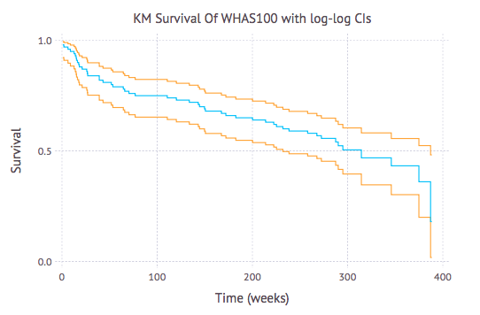

[](http://www.repostatus.org/#concept)
[](LICENSE.md)

Time-to-event and survival analysis in Julia.




Installation
------------

```julia
Pkg.clone("https://github.com/alexhallam/TimeToX.jl")
```

Table of Grammar
-------------------------

|Function        | Verb      | Noun        |  Description                                                     | 
|--------------- |:--------: |:-----------:|----------------------------------------------------------------- |
|`est_surv`      | estimate  | survival    |  Estimates the survival function with the Kaplan-Meier estimator |
|`compare_surv`  | compare	 | survivals   |  Uses the log-rank test to compare the survival curves.          |
|`reg_coxph`	 | regress	 | coxph	   |  Regression using coxph                                          |  

Getting Started
----------------

This package has the following function.

* Estimates the survival function `est_surv`

* Describes the survival function `quantile_surv`

* Compares two or more survival functions `compare_surv`


Estimating The Event (Survival) Function
-----------------------------------------

To estimate the survival function use the general form `est_surv(times, is_censored, method)`

* `times` is a vector of total times such as length of follow up.

* `is_censored` is a vector of ones and zeros. `1` indicates that the event is censored and `0` indicates that it is not censored.

* `method` is the desired method to estimate the survival function. The default is the Kaplan-Meier estimator. Other options are TBD.

Functions of this type of the following form

```julia
est_surv(times, is_censored)
```

Lets run through an example with the `whas100` dataset which is included in
this package.

```julia
julia> whas100 = readtable("../datasets/whas100.csv")
julia> times = whas100[:lenfol];
julia> is_censored = whas100[:fstat];
julia> fit = est_surv(times, is_censored)
95×7 DataFrames.DataFrame
│ Row │ time │ nrisk │ nevent │ ncensor │ estimate │ low       │ high     │
├─────┼──────┼───────┼────────┼─────────┼──────────┼───────────┼──────────┤
│ 1   │ 6    │ 100   │ 2      │ 0       │ 0.98     │ 0.922394  │ 0.99496  │
│ 2   │ 14   │ 98    │ 1      │ 0       │ 0.97     │ 0.909876  │ 0.990225 │
│ 3   │ 44   │ 97    │ 1      │ 0       │ 0.96     │ 0.896931  │ 0.984797 │
│ 4   │ 62   │ 96    │ 1      │ 0       │ 0.95     │ 0.884045  │ 0.978879 │
│ 5   │ 89   │ 95    │ 1      │ 0       │ 0.94     │ 0.871319  │ 0.972588 │
│ 6   │ 98   │ 94    │ 1      │ 0       │ 0.93     │ 0.858772  │ 0.966001 │
│ 7   │ 104  │ 93    │ 1      │ 0       │ 0.92     │ 0.846397  │ 0.959167 │
│ 8   │ 107  │ 92    │ 1      │ 0       │ 0.91     │ 0.834183  │ 0.952125 │
⋮
│ 87  │ 2595 │ 9     │ 0      │ 1       │ 0.432674 │ 0.302251  │ 0.556217 │
│ 88  │ 2610 │ 8     │ 0      │ 1       │ 0.432674 │ 0.302251  │ 0.556217 │
│ 89  │ 2613 │ 7     │ 0      │ 1       │ 0.432674 │ 0.302251  │ 0.556217 │
│ 90  │ 2624 │ 6     │ 1      │ 0       │ 0.360561 │ 0.199715  │ 0.524147 │
│ 91  │ 2631 │ 5     │ 0      │ 1       │ 0.360561 │ 0.199715  │ 0.524147 │
│ 92  │ 2638 │ 4     │ 0      │ 1       │ 0.360561 │ 0.199715  │ 0.524147 │
│ 93  │ 2641 │ 3     │ 0      │ 1       │ 0.360561 │ 0.199715  │ 0.524147 │
│ 94  │ 2710 │ 2     │ 1      │ 0       │ 0.180281 │ 0.0179118 │ 0.482039 │
│ 95  │ 2719 │ 1     │ 0      │ 1       │ 0.180281 │ 0.0179118 │ 0.482039 │

julia> Pkg.add("Gadfly")
julia> using Gadfly
# Below I divide time by 7 to show weeks instead of days
julia> plot(layer(y=fit[:estimate], x=fit[:time]/7, Geom.step),
layer(y=fit[:low], x=fit[:time]/7, Theme(default_color=color("orange")), Geom.step),
layer(y=fit[:high], x=fit[:time]/7, Theme(default_color=color("orange")), Geom.step),
Guide.title("KM Survival Of WHAS100 with log-log CIs"),
Guide.xlabel("Time (weeks)"),
Guide.ylabel("Survival"),
)
```


Quantiles of the  Survival Function
------------------------------------

Quantiles are a common descriptive statistic of the survival function.

```julia
julia> whas100 = readtable("../datasets/whas100.csv");
julia> times = whas100[:lenfol];
julia> is_censored = whas100[:fstat];
julia> whas_surv = est_surv(times, is_censored);
julia> quantile_surv(whas_surv)
3×3 DataFrames.DataFrame
│ Row │ nth_quantile │ quantile_survival │ quantile_time │
├─────┼──────────────┼───────────────────┼───────────────┤
│ 1   │ 25           │ 0.180281          │ 2710          │
│ 2   │ 50           │ 0.46873           │ 2201          │
│ 3   │ 75           │ 0.75              │ 538           │
```

Comparing Survival Functions
-----------------------------

This function uses the log-rank test to compare two
time-to-event curves.

```julia
julia> times = [6,7,10,15,19,25]
julia> is_censored = [1,0,1,1,0,1]
julia> group = is_control = [1,1,0,1,0,0]
julia> compare_surv(times,is_censored,is_control)
With a χ² value of 1.273684 the two group are not statistically significant at the α = 0.05 level
```

Regression With CoxPH
-----------------------------

```julia
julia>using JuMP, Ipopt
julia>times = [6,7,10,15,19,25];
julia>is_censored = [0, 0, 1, 0, 1, 1];
julia>is_control = [0, 0, 1, 0, 1, 1];
julia> reg_coxph(times,is_censored, is_censored)
times = [6, 7, 10, 15, 19, 25]
is_censored = [0, 0, 1, 0, 1, 1]
is_control = [0, 1, 0, 0, 1, 0]
β = -0.0988607452890646
```

What this does different
-------------------------

**Event Functions as Verbs**: When possible, time-to-event functions are verbs.
Functions could have been named `Kaplan-Meier()` or `log-rank()`, but it seems
that `est_surv()` and `compare_surv()` seem more descriptive.

ToDo
=====

 - Handel midpoints that land on horizontal parts of the step function in
 `quantile_surv()`

 - add coxph. `reg_coxph()`

 - add tests for `compare_sur()` 
